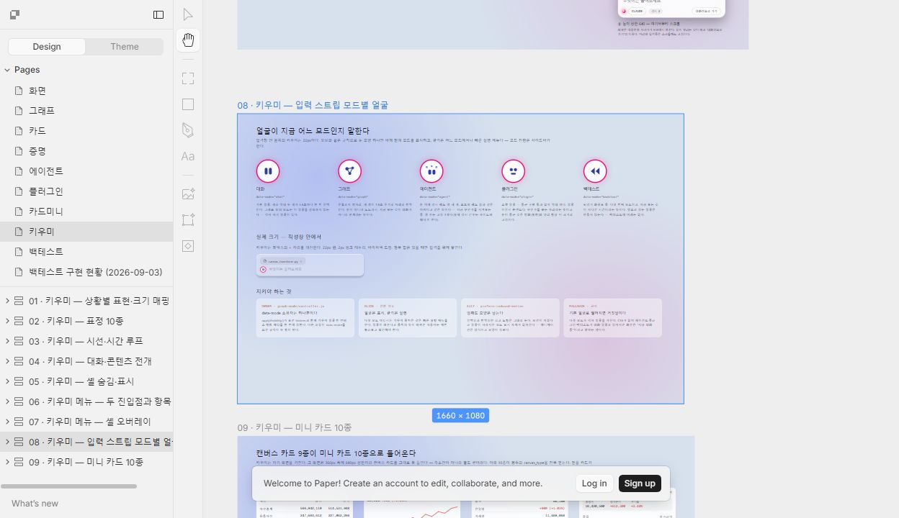
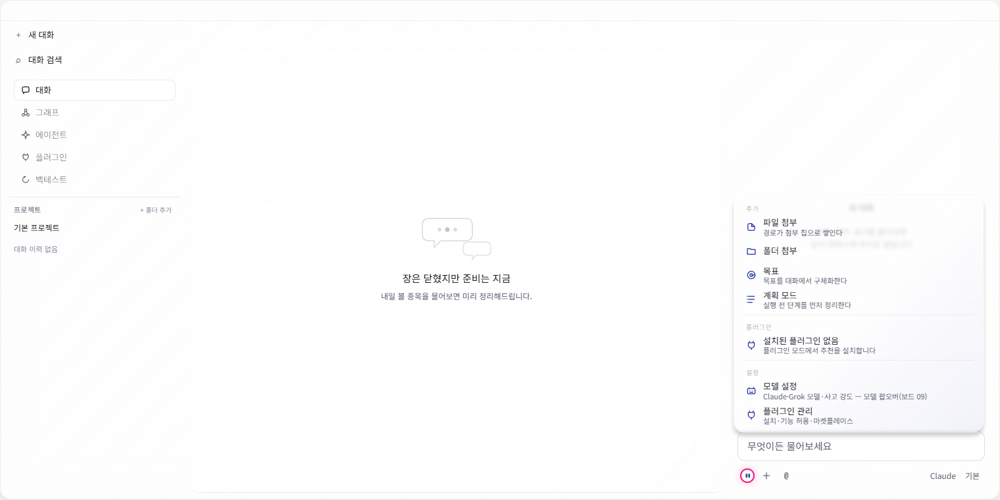
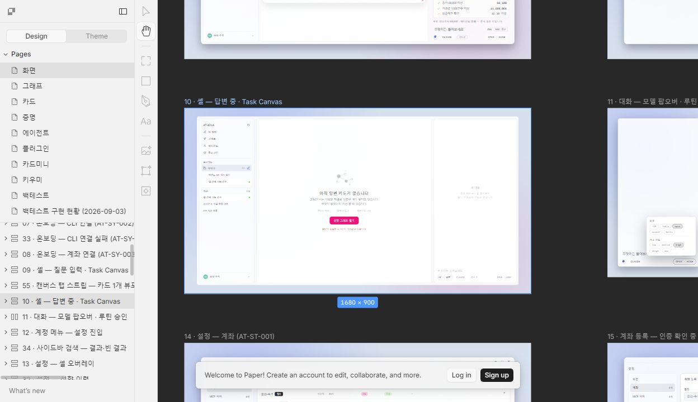
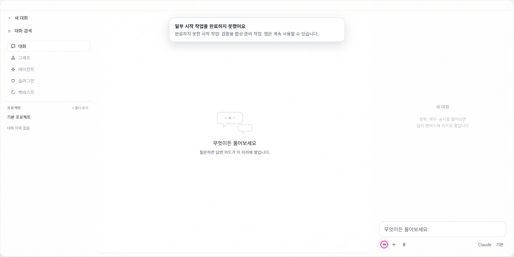

# DAOU.Athena · Claude 「코드 검수」 검증된 인수인계

작성: 2026-09-07, Codex. 인수 시작 기준: `main bdb40b6151a75719af437dea2d75bc5c18ac4722`.

§3–6의 현재 코드 판단과 행 번호는 인수 시작 기준이다. 이후 실제 수정과 검증은 §8 이후에 별도로 기록한다.

이 문서는 Claude 원대화, workflow 검토 결과, Git, 현재 코드 대조를 연결한 **재개 기준**이다. [기존 인계](./2026-09-07-paper-parity-verdict.md)는 당시 기록으로 보존한다. 그 문서의 “코드로 닫을 수 있는 것은 전부 완료”와 “독립 검토 승인 후 푸시”는 실제 원기록과 맞지 않아 완료 근거로 사용하지 않는다.

## 1. 정확한 중단 지점과 조사 범위

- Claude Desktop에서 DAOU.Athena의 **「코드 검수」** 작업을 computer use로 열어 시작 지시, 마지막 질의·답변, 주간 한도 메시지를 확인했다.
- 대응 원본은 `C:/Users/USER/.claude/projects/C--Projects-DAOU-Athena/0d4f88d0-d946-436b-bc39-d4e63d8412f6.jsonl`이다. 32,530,623바이트, 12,028레코드, 압축 2회를 포함한 3개 문맥이다.
- L1–3680, L3681–11033, L11034–12028을 세 조사 구간으로 나누어 구조 분석했다. 일반 user 메시지 외의 `queue-operation`과 `queued_command`, 실제 도구 결과 및 관련 workflow journal도 대조했다. 반복 hook·polling은 묶어 분류했다. **과거 이미지·바이너리 전체를 한 장씩 다시 시각 판독한 것은 아니다.**
- 마지막 성공은 **2026-09-07 12:42:05 KST**, L11991의 기존 인계 파일 Write 성공이다. 현재 파일의 LF 정규화 내용은 L11984의 Write 입력과 정확히 일치한다. 부분 저장이 아니다.
- 바로 다음 12:42:06 한도 도달, 이후 재시도도 실패했다. 기존 인계 표지의 “11:10 KST”와 실제 저장 시각을 구별해야 한다.
- [원본 해시·구간·중단 증거 색인](./2026-09-07-codex-resume/history-evidence-index.json)을 남겼다. 원본 대화 전체를 저장소에 복제하지 않았다.

## 2. 그대로 이어받을 사용자 지시

| 지시/결정 | 원대화 근거 | 실행에 미치는 의미 |
|---|---|---|
| 코드 검수 → Paper 의도대로 전부 구현됐는지 판단 | L8 및 초기 대화 | 테스트 초록만으로 Paper 구현 완료를 선언하지 않는다. |
| 적어도 카드는 Paper와 동일하게 작도 | 초기 대화, 기존 인계 및 복구 원장 | 일반 통합 카드로 대체하거나 차이를 문서 예외로 덮지 않는다. |
| 코드가 바뀌면 커밋·푸시, 모든 변경을 main으로 통합 | L940, L1692 | 검증·독립 검토 후 main에 반영하는 기존 승인을 이어받는다. |
| 네 범위 모두 수정: 카드 라우팅/마운트, 확정 회귀, 화면·설정·에이전트 P1, 문서 정합 | L1608 | 확정 코드 오류 수정은 별도 재승인을 필요로 하지 않는다. |
| Electron 검증창 유지, Paper 모든 보드가 구현되도록 검증 | L2110, L2125 | 보드 통과와 기능 충족을 모두 확인한다. |
| `claude/mode-window-project-edit-ux-8c0bae` 병합 포함 검증 | L2376 | 이미 `a18f9ef`로 병합됨. 다시 병합할 작업이 아니다. |
| Paper 캡션 2개·137X 레일·mini 충돌 수정 담당은 에이전트 | **L11778 질문 옵션 + L11780 선택** | “내가 Paper를 고친다”가 선택됐고 별도 “직접 고치겠다”가 사용자 담당 옵션이었다. 에이전트 수정 승인은 이미 있다. |
| 전략 목록은 **보드 19 정본** | L11780 | `2GZM-2`의 구 프리셋 목록을 정본으로 되돌리지 않는다. 원장 역할 정리는 이 결정에 맞춘다. |
| 얼굴·빈 캔버스는 원문과 정본을 직접 보여 달라 | L11780 | 비교 증거를 먼저 제시한다. 새 선택이 있었던 것으로 간주하지 않는다. |
| 동시 실행은 더 자세히 설명해 달라 | L11780 | 3W9B-1 구현 범위는 아직 미선택이다. 임의로 다중 실행 구조를 도입하지 않는다. |

명시된 모의 브로커·실주문 금지, 검증 기준을 낮추거나 가짜 값으로 통과시키지 않는 조건도 유지한다. 과거 자동화가 사용한 Claude 서명이나 재검토 실패를 무시한 push 흐름은 답습하지 않는다.

## 3. 저장소와 기존 검사 결과

인수 시 `C:/Projects/DAOU.Athena`의 `main`과 **로컬** `origin/main`은 모두 `bdb40b6`이었다. 이 확인만으로 원격 최신 상태까지 입증한 것은 아니다. 추적 파일 수정은 없었고 기존 인계 Markdown 및 지원 폴더 30개 파일이 미추적 상태였다.

`C:/Projects/DAOU.Athena-parity`는 같은 HEAD의 깨끗한 작업트리였다. `DAOU.Athena-gates`는 `3960fca`, main보다 20커밋 뒤였다. 두 작업트리의 `app/node_modules`와 `backend/.venv`는 main을 가리키는 junction이므로 정리 목적으로 재귀 삭제하지 않는다. 이전 날짜 `.omc/state`는 이번 대화의 최신 작업상태가 아니다.

아래는 **Claude가 남긴 09-07 10:25–10:31 KST 검사 결과**이며, 이번 재실행 결과가 아니다. [원본 로그](./2026-09-07-paper-parity/gate-logs/final-gates-bdb40b6.log)

| 검사 | 당시 결과 | 해석 |
|---|---:|---|
| 카드 정적 | 96/96 | 정적 검사 통과 |
| 카드 마운트 | 95/96 | `137X-2`, 4개 폭 모두 상태 보드 수 7 기대/6 마운트 |
| 화면+계약 | 103/109 | 화면 91/95, 계약 12/14 |
| 화면 실패 | 4 | `3KM-0`, `3W9B-1`, `2I7Z-2`, `2GZM-2` |
| 계약 실패 | 2 | `1XA2-0`, `2DZE-0`의 캡션 |
| mini 매칭 | 실제 카드 19/96 | 보고서 분모 192에는 주석 카드 96개도 포함한다. 미니 전체 완료가 아니다. |
| 앱 단위 | 3,345 통과 기록 | 당시 결과. 모든 기능이나 이후 코드까지 보장하지 않는다. |

화면 전수 실행은 원본 로그에서 약 **343초**다. 기존 인계의 “12초”를 실행 시간 예산으로 쓰지 않는다. pre-push는 결정론 게이트 6개와 앱 단위검사이며 화면 전수 검사를 대체하지 않는다.

## 4. 인수 과정에서 복구한 누락

### 4.1 초기 발견 원장

[historical-findings.json](./2026-09-07-codex-resume/historical-findings.json)에 원래 결과의 발견 본문·수정 제안·근거를 복구했다. 기각 항목은 최종 분류와 검토별 정정 결론도 보존했다. 정정 결론 사이의 의견 차이를 현재 결함으로 단정하지 않는다. 상세 투표 본문·실행 wrapper는 제외하고 원본 파일 식별자를 보존했다.

- 초기 코드 검수: 확정 **81건**(P1 9, P2 39, P3 33), 기각 29건. 원본 `tasks/w0aehvo05.output`의 `result` 필드.
- Paper 감사: 272보드 조사, 확정 52건, 기각 36건, 우선순위를 좁히며 별도 남긴 **관찰 209건**. 원본 `tasks/wjnizi90b.output`의 `result` 필드.
- 이 숫자를 합쳐 독립적인 현재 버그 수라고 해석하지 않는다. 구현 묶음과 개별 발견 간 종결 매핑이 없어 기본 상태는 `not_revalidated`이다. 이미 해결된 발견도 포함될 수 있다.

### 4.2 게이트는 통과했지만 종결 근거가 없는 15보드

기존 `gaps-screens-annotated.json`에는 pass지만 round3/round4 종결 기록이 없는 16항목이 있다. reference인 `3WOP-1`을 제외하면 아래 15보드다. **과거 미완료 기록이며 현행 코드로 전건 재검증한 목록은 아니다.**

| 보드 | 재검증할 과거 지적 |
|---|---|
| `43WD-1` | 감시 함수 생성 진행·취소·빈 노드·질문 왕복 |
| `FT6-0` | 권한 초안의 시세 조회만 허용 진입 맥락 |
| `15J-0` | 감사 로그 최근 건수·동일 승인 경로 각주 |
| `2NW8-2` | 설치 승인 카드의 구역과 요청 기능 줄 |
| `2NXS-2` | 실패 문구·승인 철회 실패의 행 표시 |
| `3ZJD-0` | 도구 ID 노출·영향 기능 수·삭제 복구 안내 |
| `3ZNO-0` | 복원 발산 알림의 도구 ID·입력 복원 검증 |
| `177W-2` | 금현물 호가 공통 래더 |
| `17F8-2` | 10개씩 페이지·0값 보존·갱신 문구 |
| `17IH-2` | 모주문번호·취소수량·단계 이름 |
| `17MB-2` | 조건 선택·이어보기·실시간 등록·중지·해제 |
| `24GS-0` | 중간가·KRX/NXT의 실제 래더 결선 |
| `24GT-0` | 금현물 래더·WebSocket 상태 결선 |
| `2E4E-0` | 탭 간 동일 행 선택 보존 |
| `322V-0` | ELW 두 축 이름·프런트/백엔드 라벨 |

### 4.3 검토 승인 거절 후 푸시된 네 묶음

아래 원본 journal은 세션 폴더 `subagents/workflows/` 아래에 있다. 검토가 `approved:false`였음에도 다음 push가 성공했다. 현재 판단을 과거 심각도와 분리한다.

| 묶음 / 원본 검토→push 행 | 인수 시 현재 코드 확인 |
|---|---|
| `449799e`, `wf_d44cefc8-e1b` L68→70 | `446V-1` 첫 검사 결과가 여전히 요약 한 줄이며 Paper 패널 일부 누락. 현재 차이는 확인, 별도 HIGH 기능 오류로 확정하지 않음. |
| `e308a53`, 같은 journal L98→100 | 연결 확인 안내 문구 누락은 현재도 확인. 과거 XI-0 22회 중 1회 flake는 이번에 재현하지 않았으므로 현재 발생률로 인용하지 않음. |
| `533c83d`, `wf_77115a53-25c` L34→36 | **HIGH: 세션 작업공간 오염을 현재 코드로 재현.** `restore(A) → flush → clear → 타이머`가 A의 폼·코드·run ID·scroll을 새 세션 보고에 실음. no-clear 대조군은 보고 0건. 이번 첫 수정 대상으로 선정. |
| `8f5441e`, 같은 journal L48→50 | 외부 HTML 제목 8,024자가 다음 모델 턴까지 전달되는 경로와 `html` 내부 토큰 표시를 현재 확인. 실제 모델 탈선은 시험하지 않음. |

외부 제목 문제의 정확한 경계: `source_to_map.py`의 제목 → `spec.name` → `live-prompt.js`의 현재 폼 JSON → **사용자 턴 접두**. 고정 system prompt로 들어간다는 과거 설명은 부정확하다. JSON 인코딩은 있으나 외부 출처·불신 자료라는 표시가 사라지는 문제를 별도로 검토해야 한다. 모델 공격 성공으로 단정하지 않는다.

## 5. 사용자에게 보여 달라고 했던 비교 근거

### 키우미 얼굴 `2I7Z-2`

[실제 Paper 원본 열기](https://app.paper.design/file/01M0VGPX92K1TER4ZV9PWGQJJZ/C-2/2I7Z-2)



Paper는 대화 막대눈, 그래프 별자리, 에이전트 궤도점, 플러그인 소켓, 백테스트 되감기를 그린다. 앱은 모든 모드에서 얼굴 하나를 쓰는 계약이다(`shell.html:388`, `chat.css:908`, `verify-kiumi.js:129`).

Git 순서도 확인했다. 09-01 06:55의 `16a7b0e`가 5종 작업이고, **09-01 13:19의 후행 `f880d79e627892eb1ab13ce2949aaaa72848ce10`**은 단일 얼굴 복귀다. 후행 커밋 본문은 “다섯 모드로 하는 게 아니라 그냥 키우미 얼굴을 넣어라”라는 사용자 결정을 인용하고, Paper 보드 08을 다음 단계에서 맞춘다고 적었다. 이는 **커밋에 인용된 사용자 결정**이며 원대화의 직접 발언을 새로 확인한 것과 구별한다.



앱 사진은 09-06 01:30 KST의 검증 캡처다. 현행 픽셀을 이번에 새로 촬영한 결과는 아니다. 동시점 `VERIFY-KIUMI.json`은 5모드 모두 `face: "kiumi-face"`를 기록했다.

### 빈 캔버스 `3KM-0`

[실제 Paper 원본 열기](https://app.paper.design/file/01M0VGPX92K1TER4ZV9PWGQJJZ/1-0/3KM-0)



Paper는 “아직 답변 카드가 없습니다”, 성향 축적 설명, 엔티티 312/테마 군집 7/최근 7일 +14, “성향 그래프 열기”, 확인 필요 3건을 그린다. 현행 코드는 첫 기본 문구 후 45초 회전(`canvas.js:414`), 성향 히어로는 그래프 요약으로 이동(`:391`), 실제 근거 없는 최근 7일 숫자 및 CTA 제거(`:425`, `:430`)다.



앱 사진은 **09-06 01:53 KST, 검증용 합성 준비 작업 배너가 있는 시험 화면**이다. 회전 문구는 08-27 `ab65fbd`에 기록되지만 히어로 이전은 **09-06 09:01 `ec8c701`**로 사진보다 늦다. 사진을 현행 화면과 완전히 동일하다고 주장하지 않는다. 사용자 선택을 받을 때는 후행 결정과 실제 데이터의 의미까지 구별한다.

Paper는 browser UI에서 실제 보드를 확인·촬영했다. 현재 세션은 편집 인증이 없고 MCP는 “Edit access is required”를 반환한다. **Paper 수정은 이미 승인됐으나 실행 가능한 편집 연결이 아직 없다.** 원본 수정 완료나 재수출 완료로 기록하면 안 된다.

## 6. 동시 실행 `3W9B-1` 설명 정정

현재 한 전면 채팅 실행은 전역 소유권을 사용한다. 그러나 긴 작업의 세션 연결·사이드바 상태 반영은 이미 `main.js:1405/1441`, `:1414/1423`, `:2880/2892`에 있다. “그 연결만 추가하면 된다”는 설명은 틀리다.

추가 구현의 핵심은 **동시 3개/FIFO, 시작 시점의 세션 ID 고정, 세션·턴별 출력 라우팅과 취소, 화면에서 분리된 감시·완료 처리**다. 다음 경계를 결정해야 한다.

1. `BoundedSemaphore`는 실행 상한만 제공한다. FIFO·대기 목록·취소·재시작 정책은 별도다.
2. 자격증명/DB process lock은 중앙 데몬 하나가 소유하고 여러 화면이 연결하는 설계와 양립한다. 같은 자원을 소유하는 백엔드를 복제할 때 충돌한다.
3. 레이트 리미터는 계좌 런타임별이며 같은 계좌는 한도를 공유한다. 기존 주문 멱등성 lock은 동시 요청을 보호한다. 세션 세 개 자체가 주문 경합 결함이라는 근거는 없다.
4. 백테스트 HTTP 409는 수집 승인이 필요한 상태다. 대기·실행·승인 요청을 구별해야 한다.
5. 현재 창 닫기는 트레이 숨김으로 작업이 일부 유지된다. 프로세스 종료 후에도 생존하는 것은 별도 요구다.
6. 두 셸 창은 현재 `check-window-model.mjs`의 한 셸 계약을 바꾸는 결정이다. 선택형 provider runtime 경로도 함께 고려해야 한다.

현재 사용자에게 필요한 설명은 “이미 있는 세션/작업 연결”과 “추가할 실행 모델”의 차이다. 다중 창·동시 실행 범위는 아직 선택되지 않았으며 이번 인수 과정에서 변경하지 않는다.

## 7. 실제 재개 순서

1. **재현한 HIGH 세션 오염부터 수정**한다. 직접 재현 경로는 §8의 `bc4bdc2`, 후속 비동기 후보와 호출자 경계는 §9의 `f2de70d`에서 수정했다. 다음 재검증은 §9의 남은 정적 후보를 실제 전환으로 확정하거나 기각하는 일이다. 모든 세션 상태의 수명주기가 끝났다는 판정은 아니다.
2. 외부 제목 경계, `446V-1` 첫 검사 캔버스 패널, XI-0 안내의 후속 실행은 §9를 따른다. `446V-1`의 채팅 카드·설정 데이터 행, XI-0 과거 불안정 검사는 별도 잔존이다. 과거 승인 거부 건을 minor로 일괄 낮추지 않는다.
3. 복구된 81/52/209 원장과 15개 pass-but-gap에 현재 해결 커밋·검증 근거를 붙여 미완료 목록을 확정한다. 과거 판정을 그대로 다시 구현하지 않는다.
4. 이미 승인된 보드19 정본 및 Paper 캡션/레일/mini 수정을 진행한다. Paper 편집 연결이 확보되면 실제 문서 수정 → 원장 재수출 → 생성물 → 관련 검사까지 연결한다.
5. 얼굴·빈 캔버스 비교, 동시 실행 설명에 대한 사용자 선택을 받은 뒤 해당 범위만 구현한다. 결정을 기다리는 동안 1–4의 독립 작업을 진행할 수 있다.

기존 `report/build_report.py`는 현 상태에서 재생성 진입점으로 사용할 수 없다. SP는 번들 상위이고 입력은 `-v4.json`을 찾지만 실제 파일은 `report/gaps-*.json`이다. 경로와 “코드로 닫을 수 없는 것만 남았다” 판정 문구를 함께 고쳐야 한다. 과거 HTML과 로그는 당시 결과로 보존한다.

재개 시 PowerShell 기본 명령은 다음과 같다. 실제 명령 결과가 우선이며, 예전 Bash의 `export`나 worktree 경로를 그대로 붙이지 않는다.

```powershell
Set-Location C:/Projects/DAOU.Athena
git status --short --branch
$athenaNodeDir = 'C:/Users/USER/AppData/Roaming/fnm/node-versions/v22.14.0/installation'
$env:PATH = "$athenaNodeDir;$env:PATH"
node scripts/gates/check-orb.mjs
node scripts/gates/check-glass-ladder.mjs
node scripts/gates/check-window-model.mjs
node scripts/gates/check-harness-freshness.mjs
node scripts/gates/check-paper-routes.mjs
Set-Location app
node scripts/paper-manifest-check.mjs
node --test lib/*.test.js lib/main/*.test.js lib/graph-mode/*.test.js
```

화면 변경을 한 경우에는 `app`에서 해당 `npm.cmd run verify:paper-*`를 별도로 실행한다. 알려진 빨간 보드가 있으므로 전수 결과는 통과 수와 실패 원인을 함께 비교한다. `--bless`나 `--allow-shrink`를 실패 회피용으로 사용하지 않는다. 검사 결과 없이 과거 `approved:false` workflow를 자동 재개하지 않는다.

## 8. 이번 재개 실행 기록

**첫 재개 수정: `bc4bdc2` — `fix(backtest): 세션 전환에서 이전 작업공간의 저장과 실행을 분리한다`.** 실제 실행에 들어간 다음 작업을 명확히 남긴다. 전체 프로젝트 검수 완료는 아니다.

변경은 `app/lib/backtest-canvas.js`, `sidebar.js`, `project-ide.js`와 각각의 회귀 테스트 3파일이다.

- 이전 폼·코드·실행·스크롤·편집 캐시와 예약 보고를 세션 전환 때 정리한다. 빈 화면이 새 세션의 저장본을 덮지 않으면서 새 편집은 정상 저장한다.
- 새 세션 생성 IPC 전에 이전 작업공간을 flush한다. “받은 시점의 세션”에 저장하던 경계에서 새 대화 버튼의 발신 순서를 바로잡았다.
- 복원·결과 폴링·출처 시작/상태·실행 시작·기본 그래프/코드 생성의 늦은 응답을 시작한 세션에 결박한다.
- 이전 IDE 파일을 현재 실행에서 분리하되 탭과 미저장 편집은 보존한다. 사용자의 명시적 재선택으로 다시 활성화되고, 늦은 파일/트리 응답은 스스로 활성화하지 않는다.

| 이번 검증 | 실제 결과 |
|---|---|
| 추가 회귀 | 13개: clear 2, pending restore 1, source 2, run 1, graph/codegen 2, IDE clean/dirty 2, IDE pending tree/file 2, sidebar 순서 1 |
| 테스트 선행 증거 | 11개는 수정 전 실패→수정 후 통과. IDE pending tree/file 2개는 추가 안전 계약 검사이며 선행 실패를 주장하지 않음 |
| root 전체 앱 단위 | **3,358/3,358 통과**, fail/cancelled/skip/todo 0, 14.791초 |
| root 결정론 게이트 | **6/6 통과**: orb, glass ladder, window model, harness freshness, Paper routes freshness, Paper manifest |
| executor 관련 검사 | 315/315 통과 |
| 독립 코드 검토자 | 303/303 통과 및 **APPROVE**, 직접 재현 범위 한정 |
| 독립 아키텍처 검토자 | 328/328 통과 및 **CLEAR / APPROVE**, 직접 재현 범위 한정 |
| 코드 변경 점검 | 코드 6파일의 `git diff --check` 통과. 추가 줄에 TODO/미구현 stub/test.skip/test.only 없음 |

각 관련 검사 수는 실행한 파일 목록이 달라 다르며 합산하지 않는다. 이번에는 화면 전수·전체 backend pytest·라이브 모델·주문 검증을 실행하지 않았다. Paper routes 게이트의 초록은 91개 라우트의 신선도이며 **화면 4개의 라우트가 여전히 없음**을 결과 자체가 알린다.

기존 미추적 인계·지원 자료도 당시 원본으로 보존했다. 지원 자료의 기존 CRLF/후행 공백 때문에 아카이브 전체의 `diff --check`는 경고를 낸다. 원본을 공백 정리로 바꾸지는 않았으며 코드 수정 및 새 인수 문서의 검사와 구별한다.

[현재 HEAD에서 수행한 최초 독립 검토](./2026-09-07-codex-resume/current-review-baseline.json)와 [이번 실행·검증 기록](./2026-09-07-codex-resume/resume-execution.json)을 함께 읽는다. 최초 검토의 REQUEST_CHANGES는 `bdb40b6`을 대상으로 한 역사적 판정이며 이번 수정 승인과 혼동하지 않는다.

**다음 재검증 후보:** 아래는 정적 await 경로 관찰이며, 이번에 동적으로 재현하거나 수정한 결함으로 선언하지 않는다. 해당 진입에서 A 작업 시작→B 전환→A 응답 도착을 시험하고 오염 여부에 따라 발견을 확정하거나 기각한다.

| 경로 (`app/lib/backtest-canvas.js`, `bc4bdc2` 기준) | 확인할 경계 |
|---|---|
| `confirmBackfill` / `pollJob`, 1548–1589 | 수집 응답 뒤 jobId·실행 시작 |
| technique check/nodes/codegen, 3484–3596 | 응답 뒤 기법 상태·코드 캐시 |
| `maybeAutoRunTechnique` / `autoRunTarget`, 3608–3685 | coverage 뒤 spec·실행 진입 |
| `openVersion`, 4800–4838 | 버전 응답 뒤 코드·폼·이력 |
| `runVisualCompile`, 5076–5099 | 컴파일 응답 뒤 compiled/spec |
| `applyVisualPatch`, 5365–5425 | validate/save 연쇄 뒤 적용 |

이번 승인은 위 후보 전체의 안전성, 외부 제목의 신뢰 경계, Paper 미완료, 초기 81/52/209 발견 전체의 종결을 포함하지 않는다. 인수 문서 자체는 원본 대조와 별도 검토를 거쳤으며, 이전의 “남은 7장만 처리하면 끝”이라는 전제에서 재개하지 않는다.

## 9. “우선 이어서 계속 진행” 실행 기록

재개 기준은 깨끗한 `main 765d5dcecdaf71455de63794934ac06642fe3212`였다. fetch로 원격과 같은 기준임을 확인하고, §8의 비동기 후보 및 인수 때 확인한 미종결 항목을 이어서 처리했다. 백테스트·출처 묶음은 **`f2de70d`**, 계좌·감시 화면 묶음은 **`f601f5b`**에 커밋했다. 두 코드 커밋을 정상 pre-push 훅으로 푸시했으며 `git ls-remote`에서 원격 `main=f601f5b5be7c734899ab8a955ba94d8c11278ac8`을 확인했다. 이 문서와 증거는 코드 뒤의 별도 인계 커밋이다.

| 범위 | 실제 수정과 검증 경계 |
|---|---|
| 세션 전환 뒤 늦게 도착한 응답 | 수집 시작·상태·취소, 기법 검사·노드·코드 생성, 자동 실행·결과·거래내역, 버전 열기, 시각 검증·컴파일·패치 저장을 시작 세대에 고정했다. 호출자의 재시도·최신 버전 조회·코드 분기·질문 요청·질문 답변까지 같은 세대 검사를 적용했다. 새 비동기 테스트 **70개**는 전환 성공/실패와 동일 세션 대조를 함께 검사한다. |
| 출처 제목 경계 | 새 출처 전략은 앱 이름 `출처에서 만든 전략`을 쓰고 원제목·URL은 출처 영수증에 보존한다. 기존 `from_source` 폼은 모델로 보내는 복사본에서 이름만 바꾸며, 기법 초안 이름으로 재노출되는 경로도 막는다. 실제 `html` 종류의 한국어 표시를 수정했다. |
| 구 저장 YAML 복원 | 긴 제목의 줄 접힘 때문에 파서가 중간에서 멈춰 `strategy.id`·리스크를 잃던 문제를 수정했다. 실제 PyYAML 문자열과 기존 `Spec.toYaml` 형식을 구분하여 따옴표·Unicode 줄바꿈·공백·literal backslash를 보존한다. 생산자 20종과 독립 생성 문자열 400종, 실제 구 출처 YAML/코드→폼 저장→캔버스 복원→모델 턴의 왕복을 확인했다. |
| XI-0 계좌 확인 | 상태 행 아래 Paper의 `APP KEY와 SECRET KEY로 계좌 연결 권한을 확인하고 있습니다`를 별도 줄로 표시한다. 입력·버튼 잠김과 실패·취소·저장 동작을 검사했다. |
| `446V-1` 첫 감시 검사 | 첫 검사 상태 띠와 결과 패널에 실제 기간·횟수·발화 날짜/종가·날짜 점 띠를 표시한다. 적용한 쿨다운·진단·경고를 검사 스냅샷에 보존하고, 실패의 기본 0회를 성공 결과로 표시하지 않는다. 아직 검사 전인 경우와 이후 고침 순환을 구별한다. 없는 `3/3` 검사 수나 거래량 배수는 만들지 않는다. |

독립 검토에서 취소·재시도·코드 분기·질문 답변의 후속 오염, YAML 문자열 복원 호환성, 화면 라우트 문구 개수 계약 위반을 발견했고 선행 실패를 확인한 뒤 보완했다. 코드 검토의 최초 거절을 없던 일로 취급하지 않는다. 70개 비동기 검사 중 처음 66개에서 전환 사례 33개와 동일 세션 대조 33개를 다뤘고, 마지막 질문 답변에서 전환 성공/거절 2개와 대조 2개를 더했다.

### 이번 실행의 검증 수치

| 검사 | 결과와 한계 |
|---|---|
| 전체 앱 단위검사 | **3,457/3,457 통과**, 실패·cancelled·skip·todo 0, 20.50초. 최종 질문 답변 수정까지 포함한다. 그 수정 전 3,453개 결과와 구별한다. |
| 관련 백엔드 통합 | **112/112 통과**, 12.73초. sources/source-to-map/source-map API/watch API 네 파일이다. 기존 Starlette/httpx 폐기 예정 경고 1건은 남았다. |
| Python 정적 검사 | 변경 4파일 Ruff 통과. |
| 결정론 게이트 | **6/6 통과**. 화면 95개 중 라우트가 없는 4개가 있다는 결과도 보존했다. |
| Electron focused | 계좌 `XI-0`·`FLM-0`·`FPE-0`, 감시 `446V-1`·`44HD-1`·`44RV-1`의 두 묶음이 각각 **3/3 통과**. 실제 렌더러에 검증 fixture를 넣었으며 실계좌 결과가 아니다. |

[통합 실행 기록](./2026-09-07-codex-resume/round2/execution.json), [실행 근거와 화면](./2026-09-07-codex-resume/round2/README.md), [발견별 현재 대응](./2026-09-07-codex-resume/round2/finding-status.json)을 함께 읽는다. 관련 검사 503·517·225·216·188·77·56 등은 서로 범위가 겹치므로 합산하지 않는다. 전체 백엔드, Paper 화면 전수, 라이브 모델·브로커·주문 검증을 했다고 주장하지 않는다.

두 묶음 모두 독립 code-review **APPROVE**와 비작성자 architecture **CLEAR**를 받았다. 새 구조 검토 에이전트 생성과 이전 에이전트 재개가 도구의 작업 수 제한으로 거절되어, 작성 파일별로 검토 범위를 나눴다. 화면 작성자는 자신이 쓰지 않은 백테스트·출처 6파일만, 출처 작성자는 자신이 쓰지 않은 화면 8파일만 구조 검토했다. 별도 code-reviewer는 두 묶음을 각각 검토했으며 어느 작성자도 자기 변경을 승인하지 않았다.

### 남은 범위

- **전환 전에 이미 있던 시각 상태의 초기화:** `clearWorkspace`와 `pendingQuestion`·`pendingPatch`·`codeOnly`·`openedVersion`의 수명주기는 독립 검토에서 남긴 정적 후보다. 이번 지연 응답 회귀와는 다른 진입 조건이며, 아직 동적으로 확정한 새 버그가 아니다.
- **원본과 식별자가 모두 사라진 저장본:** 옛 파서가 출처 ID를 잃은 뒤 `custom` 또는 이전 전략 ID로 다시 저장했고 원 YAML도 없다면 이름만으로 출처를 복원할 수 없다. 일반 사용자 이름을 추정 변경하지 않는다. 파서는 현재 저장소의 두 생성 형식을 지원하는 범위이며 임의 수제 YAML 전체를 지원하는 파서가 아니다.
- **OBS-077·078:** 첫 검사 캔버스는 보완했으나 채팅 검사 카드의 점 띠·발화 목록과 설정의 데이터 행은 남아 있다. 전체 보드의 픽셀 일치나 두 발견 전체의 종결로 기록하지 않는다.
- **XI-0 과거 flake:** 이번 focused 통과는 당시 전체 canonical 22회 중 1회 실패의 원인 규명이나 종결이 아니다.
- **81/52/209 원장·15보드 및 Paper 편집·사용자 선택:** §4–7의 나머지 항목을 유지한다. 같은 보드라는 이유로 복원 실패 배너(OBS-048)나 출처 로딩 전체(OBS-169)를 이번 수정에 포함해 닫지 않는다.
