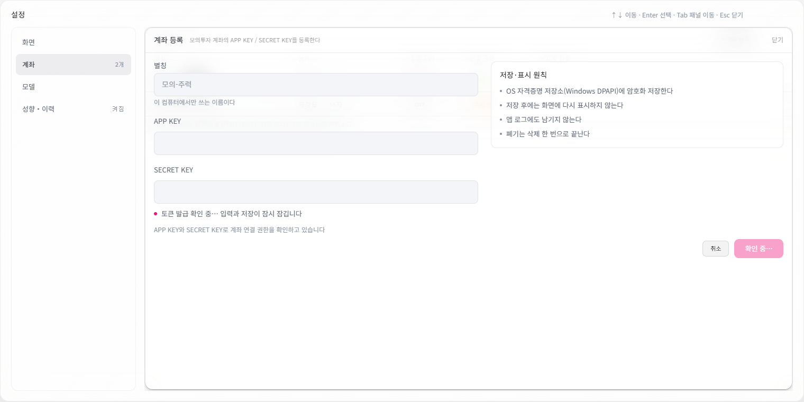
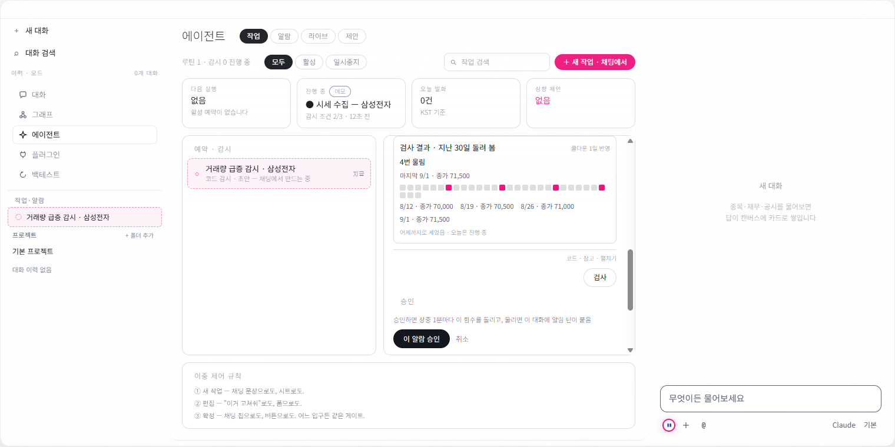

# 재개 2차 검증 근거

기준 커밋은 `765d5dcecdaf71455de63794934ac06642fe3212`이며 사용자의 “우선 이어서 계속 진행해줘” 지시를 수행한 기록이다. 최종 판정은 상위 [인수인계](../../2026-09-07-codex-resume.md)의 후속 실행 절과 함께 읽는다.

## 계좌 등록 화면

[실행 기록](./account-execution.json)은 작성자의 선행 실패·통과·격리 조건을 담는다. [관련 단위검사 로그](./account-related-tests.log), [정식 focused probe 결과](./account-PAPER-SCREENS-focused.json), [추가 캡처 실행 결과](./account-PAPER-SCREENS-capture.json)를 보존했다. 두 실행은 같은 세 보드를 검사한 것으로 6개 독립 보드나 전수 검사로 합산하지 않는다.

아래 사진은 **실제 Electron 렌더러에서 검증용 계좌 fixture로 만든 화면**이다. 실제 키움 계좌의 연결 검증을 수행한 사진이 아니다. 확인 중 상태는 등록 응답을 대기시키는 기존 probe fixture로 만들었다.



- [XI-0 실제 텍스트·구조 측정](./account-XI-0.json): 안내 두 줄의 순서, 입력 세 개와 버튼 잠김.
- [FLM-0 측정](./account-FLM-0.json), [사진](./account-FLM-0.png): 실패 설명과 “다시 검증”.
- [FPE-0 측정](./account-FPE-0.json), [사진](./account-FPE-0.png): 확인 완료 설명과 “계좌 저장”.

[진단 캡처 wrapper](./account-capture-account-sheets.cjs)는 기존 probe의 최종 측정 위치에 파일 저장만 삽입한다. 프로덕션 probe나 합격 판정을 수정하지 않았다. 실행 당시 위치와 명령은 실행 기록을 따른다.

과거 XI-0 불안정 결과는 여전히 별도다. 원본 검토에는 전체 canonical 실행 22회 중 1회 실패가 기록되어 있지만 당시 실패 JSON은 덮어써졌다. 이번 focused 두 실행 통과만으로 그 문제의 원인이나 종결을 입증하지 않는다.

## 첫 감시 검사 화면

[실행 기록](./watch-execution.json), [관련 앱 검사](./watch-frontend-tests.log), [관련 백엔드 검사](./watch-backend-tests.log), [최종 화면 검사](./watch-PAPER-SCREENS-focused.json)를 보존했다. 최종 화면 검사는 `446V-1`, `44HD-1`, `44RV-1` 세 화면을 대상으로 2026-09-07T06:15:07.404Z에 생성됐다. `446V-1`은 문구 7개와 구조 조건 12개를 검사한다.



위 그림은 **실제 Electron 렌더러에 검사 fixture를 넣은 화면**이다. 실제 시세나 실계좌 검사 결과가 아니다. 제품은 검사 응답의 날짜·종가·횟수·쿨다운 스냅샷을 사용하며, 그림의 특정 값은 검사 입력이다. 원래 상세 열에 스크롤이 있으므로 [처음 열린 화면](./watch-446V-1.png)에는 상태 띠와 노드 상단이 보이고 결과 패널은 아래에 있다.

- [446V-1 측정](./watch-446V-1.json): 첫 검사 상태·결과 패널, 점과 발화 목록, 기존 승인 동작의 구조.
- [44HD-1 측정](./watch-44HD-1.json), [사진](./watch-44HD-1.png): 이후 고침 순환 화면.
- [44RV-1 측정](./watch-44RV-1.json), [사진](./watch-44RV-1.png): 활성 코드 알람 화면.
- [진단 캡처 wrapper](./watch-capture-watch-check.cjs): 최종 측정 후 그림을 저장하고, 추가 그림에서만 검사 패널로 스크롤한다.

OBS-077의 **채팅 카드** 점 띠·발화 목록, OBS-078의 설정 **데이터 행**은 별도 잔존 사항이다. 첫 검사 캔버스 패널을 추가한 사실을 그 두 역사적 발견 전체의 종결이나 보드 전체의 픽셀 일치로 확대하지 않는다.

## 검사 결과를 읽는 법

[현재 발견과 역사적 원장 대응](./finding-status.json)은 [초기 발견 원장](../historical-findings.json)을 수정하지 않고 이번 근거를 덧붙인다. 같은 보드의 서로 다른 지적을 합치지 않는다. [백엔드 통합 검사](./backend-focused.log)는 관련 4개 파일 112개 통과이며, 다른 관련 묶음의 56개·77개와 합산하지 않는다. [결정론 게이트](./deterministic-gates.json)는 6종의 실행 결과다. 화면 4개에 라우트가 아직 없다는 게이트 자체의 보고도 보존한다.

## 출처와 저장 YAML 경계 재현

[출처 실행 기록](./source/execution.json)은 HTML 제목, 기존 프롬프트, PyYAML 접힌 문자열, 일반 이름의 Unicode 공백·literal backslash, 늦은 질문 답변의 선행 실패를 구분한다. [실제 구 출처 입력](./source/legacy-source.json), [원문·전체 턴 왕복 결과](./source/legacy-roundtrip.json), [20개 생산자 대조](./source/producer-corpus.json), [독립 문자열 400개 대조](./source/reviewer-corpus.json)를 남겼다. 이 데이터의 제목과 코드는 검증용 합성 입력이다.

원래 `.omc/artifacts`에 있던 재현 스크립트 두 개를 아래 위치로 옮기며 저장소 루트 탐색 경로를 바꾸고, Python 결과 파일의 줄바꿈을 LF로 고정했다. 판정 로직은 그대로다. 옮긴 스크립트도 **20/20·400/400·왕복 2/2**로 직접 재실행했다. 실행하면 같은 폴더의 검증 JSON이 갱신된다. 저장 데이터나 실제 계좌·모델에 접근하지 않는다.

```powershell
# 저장소 루트에서 — Node가 PATH에 있어야 한다.
node docs/handoff/2026-09-07-codex-resume/round2/source/verify-legacy-roundtrip.js

# backend에서 — 이 저장소의 Python 가상환경을 사용한다.
$env:PYTHONUTF8 = '1'
$env:PYTHONPATH = '.'
./.venv/Scripts/python.exe ../docs/handoff/2026-09-07-codex-resume/round2/source/verify-boundary.py
```

형식 구분은 출처 신뢰도 추정이 아니다. 기존 폼 writer의 `version: "1.0"`과 백엔드 PyYAML의 `version: '1.0'`은 다른 문자열 이스케이프 계약을 사용한다. 출처 식별은 파싱한 실제 `strategy.id`→`presetId`를 사용한다. 원본과 식별자가 이미 유실된 저장본은 이름으로 추정 복원하지 않는다.

저장소는 `.gitattributes`에서 줄바꿈 자동 변환을 끈다. 이번 인계의 새 로그·검증 JSON 복사본 중 CRLF 파일은 내용 변경 없이 LF로 통일했다. [변환 전·후 해시](./evidence-normalization.json)를 남겼고 `.omc/artifacts`의 원본은 수정하지 않았다. 이전 인계 아카이브의 줄바꿈도 바꾸지 않았다.
