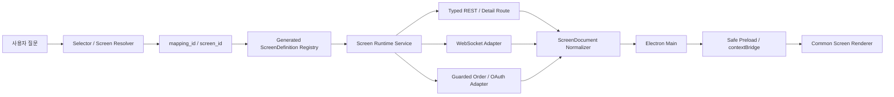

# 키움 REST API 최적 화면 선택 및 실제 렌더링 연결 상세 실행계획

> 기준일: 2026-08-15  
> 저장소: `C:\Projects\DAOU.Athena`  
> 상위 목표: 키움 REST/WebSocket/주문/OAuth 응답을 안전하고 결정적인 공통 화면 계약으로 변환하여 실제 Athena Electron 화면에 표시한다.  
> Ultragoal 상태: G001 완료, G002 진행 중, G003~G007 대기  
> 핵심 판정: Output 분류와 화면용 API projection은 구현되어 있으나 최적 화면 선택, 정규화 문서, 안전한 IPC, 실제 renderer 연결과 전수 검증은 미완료다.

---

## 1. 문서 목적

이 문서는 다음 질문에 대한 구현 기준과 완료 조건을 하나로 고정한다.

1. 사용자 질문에서 어떤 REST API 또는 detail projection을 선택할 것인가?
2. 선택된 API의 원시 Output을 어떤 화면 구조로 변환할 것인가?
3. Electron renderer가 backend transport, TR ID, 인증 토큰을 알지 않고도 화면을 그리게 하려면 어떤 계약이 필요한가?
4. read/display, WebSocket, order, OAuth를 동일 화면 체계 안에서 어떻게 구분하고 보호할 것인가?
5. 301개 routable mapping과 모든 노출 필드가 실제 backend/IPC/DOM 경로에 연결되었음을 어떻게 증명할 것인가?

이 계획은 301개 화면을 각각 수작업으로 만드는 계획이 아니다. 하나의 생성 파이프라인, 두 개의 정규화 계약, 소수의 공통 renderer primitive와 manifest-driven 검증을 통해 전체를 커버하는 계획이다.

---

## 2. 기준 문서와 권위 있는 입력

### 2.1 요구사항과 실행 상태

- `plan/kiwoom-common-screen-brief.md`
  - 제품 결과, 범위, 안전 불변식, 최종 품질 게이트의 원본이다.
- `plan/kiwoom-common-screen-handoff.md`
  - G001 완료 증거, G002 구현 계약, 현재 미완료 항목과 재개 지점의 원본이다.
- `.omx/ultragoal/goals.json`
  - G001~G007의 durable story 상태와 objective의 원본이다.
- `.omx/ultragoal/ledger.jsonl`
  - story별 checkpoint와 검증 증거의 감사 원장이다.

### 2.2 생성과 API 계약

- `backend/ref/kiwoom-tr-inventory.json`
  - 208개 원본 operation의 기준 inventory다.
- `backend/ref/kiwoom-output-profile.json`
  - Output shape, field/list 규모, 화면 복잡도와 detail 후보의 기준이다.
- `backend/ref/response-projections.json`
  - 22개 split-original query를 115개 의미 단위 detail route로 분해하는 기준이다.
- `backend/ref/kiwoom-common-screen-manifest.json`
  - G001에서 생성한 301개 routable mapping과 22개 exclusion의 단일 커버리지 원장이다.
- `backend/scripts/generate_api.py`
  - 위 입력을 검증하고 generated model, registry, route, manifest를 만드는 결정적 생성 경로다.

### 2.3 현재 runtime

- `backend/athena_api/api/llm_tools.py`
  - 기존 search/describe/resolve/call API다. 새 screen resolver는 이 selector를 우회하지 않고 재사용해야 한다.
- `backend/athena_api/selector/*`
  - 질문에서 operation을 찾고 signed plan token을 발급하는 transport-neutral selector다.
- `app/main.js`, `app/chat.js`, `app/canvas.js`
  - 현재 Electron shell과 mock canvas runtime이다. 현재 `mock:true`, 직접 `ipcRenderer`, `nodeIntegration:true`, `contextIsolation:false` 경계는 최종 구조로 사용할 수 없다.

---

## 3. 현재 기준선

### 3.1 정량 범위

| 항목 | 현재 기준 |
|---|---:|
| 원본 operation | 208 |
| unsplit base mapping | 186 |
| split-derived detail mapping | 115 |
| routable mapping 합계 | 301 |
| 의도적으로 제외한 split-original query | 22 |
| read/display mapping | 264 |
| WebSocket mapping | 23 |
| order mapping | 12 |
| OAuth mapping | 2 |

수량 불변식은 다음과 같다.

```text
186 unsplit base + 115 split-derived detail = 301 routable mappings
301 = 264 read/display + 23 WebSocket + 12 order + 2 OAuth
208 original operations - 22 split-original exclusions + 115 detail mappings = 301
```

### 3.2 Output shape 기준선

208개 원본 operation은 현재 다음과 같이 분류된다.

| Shape | 개수 | 기본 의미 |
|---|---:|---|
| `scalar_only` | 36 | 단일 값 또는 facts 중심 |
| `pure_list` | 111 | table/list 중심 |
| `compound` | 61 | facts와 list가 함께 있거나 복수 section 필요 |

화면 복잡도 기준은 `SCREEN_BUDGET=20`, list UI page size 기본값은 10이다. `kind == query`, `shape != pure_list`, `screen_complexity > 20`인 22개 operation이 detail projection 후보다.

### 3.3 현재 완료된 부분

- 208개 Output shape와 복잡도 분석
- 22개 detail 후보 선정
- 115개 detail projection route 생성
- 301개 common-screen mapping 생성
- 22개 split-original exclusion 보존
- category partition, uniqueness, orphan, provenance, projection route 검증
- catalog API에서 output profile, projection, detail group과 route 노출
- 관련 output/manifest/projection/OpenAPI 타깃 테스트 `69 passed`

### 3.4 현재 미완료 또는 red 상태

- `ScreenDefinition`과 `ScreenDocument` 모델이 없다.
- 301개 mapping을 normalized screen definition으로 생성하는 artifact와 registry가 없다.
- 원시 REST 응답을 `ScreenDocument`로 바꾸는 backend adapter가 없다.
- selector 평가가 `76 passed, 22 failed`다.
  - detail 질문에서 base operation을 선택한다.
  - 모호한 account 질문을 clarification 없이 확정한다.
  - 한국어/영어 detail title 충돌 시 다른 operation의 group이 먼저 랭크된다.
- Electron은 REST catalog/profile/projection을 읽지 않고 `stream`, `reader`, `table` mock type을 고른다.
- renderer가 `ipcRenderer`를 직접 사용한다.
- `nodeIntegration:true`, `contextIsolation:false`다.
- malformed/unknown/empty/auth-required 응답의 공통 renderer fallback이 없다.
- 301개 mapping의 DOM/IPC/field sentinel 검증이 없다.
- 실제 FastAPI fixture부터 Electron 화면까지 이어지는 end-to-end 증거가 없다.

---

## 4. 핵심 설계 원칙

### 4.1 선택과 표현을 분리한다

selector의 책임은 `mapping_id` 또는 `screen_id`를 고르는 것까지다. selector와 LLM이 `table`, `chart`, `card` 같은 UI 컴포넌트를 직접 선택하지 않는다.

화면 형태는 `ScreenDefinition`이 결정하며, 실제 데이터와 상태는 backend adapter가 만든 `ScreenDocument`가 제공한다.

```text
사용자 질문
  → selector가 mapping_id 선택
  → mapping_id로 ScreenDefinition 조회
  → backend가 REST/WS/action 실행
  → 원시 응답을 ScreenDocument로 정규화
  → Electron main이 안전한 IPC로 전달
  → renderer가 section kind와 state만 보고 표시
```

### 4.2 301개 전용 화면을 만들지 않는다

301개 mapping은 301개의 정의이지 301개의 별도 renderer 파일이 아니다. renderer는 다음 공통 primitive를 조합한다.

- `facts`
- `table`
- `event_stream`
- `status`
- `action`
- `order_receipt`

operation별 차이는 generated definition, field binding, label, section composition과 최소 reviewed override로 흡수한다.

### 4.3 transport 세부사항을 renderer에 노출하지 않는다

renderer는 다음을 알지 못해야 한다.

- Kiwoom TR ID 처리 규칙
- REST URL과 HTTP header
- continuation header 규칙
- WebSocket protocol constant
- OAuth token 또는 credential
- signed plan token, cursor token, subscription token, action token의 내부 구조
- 계좌 선택과 주문 confirmation의 backend 검증 방식

이 정보는 backend와 Electron main 경계 뒤에 둔다.

### 4.4 raw와 display를 분리한다

금융 데이터는 선행 0, 부호, 공백, 단위, 코드 값이 의미를 가질 수 있다. 전역 숫자 강제 변환을 금지한다.

```json
{
  "fieldId": "cur_prc",
  "raw": "-001250",
  "display": "-1,250",
  "semanticType": "price",
  "unit": "KRW"
}
```

formatter가 실패해도 `raw`는 보존되어야 하며, 민감 필드는 별도의 redaction 규칙을 적용한다.

### 4.5 안전한 실패를 정상 상태로 취급한다

`empty`, `unavailable`, `auth_required`, `action_required`, `error`는 예외적으로 화면이 깨진 상태가 아니라 정상적으로 표현해야 하는 `ScreenDocument.state`다.

---

## 5. 목표 아키텍처



### 5.1 생성 시점 경로

```text
kiwoom-tr-inventory.json
  + kiwoom-output-profile.json
  + response-projections.json
  + reviewed screen overrides
  → build_common_screen_manifest()
  → build_screen_definitions()
  → kiwoom-screen-definitions.json
  → generated Python registry
  → JSON/Pydantic schema validation
```

### 5.2 런타임 경로

```text
question + arguments
  → existing selector resolve
  → operation_ref + mapping_id + plan token
  → ScreenDefinition lookup
  → existing call execution
  → raw data + continuation
  → ScreenDocument normalization
  → Electron main-owned cursor/action/subscription token
  → preload allowlist
  → renderer state + sections
```

---

## 6. `ScreenDefinition` 계약

`ScreenDefinition`은 generated, versioned, immutable presentation definition이다. 하나의 routable mapping마다 정확히 하나가 존재해야 한다.

### 6.1 권장 모델

```json
{
  "version": 1,
  "screenId": "detail:kt00018:holdings",
  "source": {
    "mappingId": "detail:kt00018:holdings",
    "operationRef": "detail:kt00018:holdings",
    "trId": "kt00018",
    "route": "/api/v1/tr/account/kt00018/detail/holdings",
    "kind": "query",
    "domain": "account"
  },
  "mode": "read",
  "title": {
    "ko": "보유 종목",
    "en": "Holdings"
  },
  "controls": [
    {
      "fieldId": "qry_tp",
      "source": "user",
      "control": "select",
      "required": true,
      "sensitive": false
    }
  ],
  "sections": [
    {
      "id": "holdings",
      "kind": "table",
      "fields": ["stk_cd", "stk_nm", "rmnd_qty", "evlt_amt"],
      "pageSize": 10
    }
  ],
  "continuation": {
    "supported": true,
    "strategy": "http_header",
    "cursorOwner": "electron_main"
  },
  "safety": {
    "requiresAuth": true,
    "requiresAccount": true,
    "sideEffect": "none",
    "autoExecute": false
  },
  "provenance": {
    "manifestVersion": 1,
    "outputProfileOperation": "kt00018",
    "projectionGroup": "holdings"
  }
}
```

### 6.2 필수 필드

| 필드 | 역할 |
|---|---|
| `version` | 계약 migration 기준 |
| `screenId` | renderer-facing 유일 식별자 |
| `source` | mapping과 원본 operation의 추적성 |
| `mode` | `read`, `websocket`, `order`, `oauth` 구분 |
| `title` | 한국어/영어 표시와 selector title 충돌 검증 |
| `controls` | request leaf의 입력/상수/secret 분류 |
| `sections` | response field의 화면 목적지 |
| `continuation` | pagination/cursor 정책 |
| `safety` | auth/account/confirmation/side-effect 경계 |
| `provenance` | 생성 근거와 override 감사 추적 |

### 6.3 request leaf 분류

모든 request leaf는 정확히 하나로 분류되어야 한다.

1. `user`
   - renderer에서 사용자가 입력하거나 선택한다.
2. `injected_constant`
   - backend 또는 main이 protocol 상수로 주입한다.
3. `main_process_secret`
   - credential, authorization, token 등 renderer에 노출하면 안 된다.
4. `generation_failure`
   - 의미를 안전하게 결정할 수 없는 경우 생성을 실패시킨다.

unknown 상태를 빈 control로 조용히 남기는 것을 금지한다.

### 6.4 section layout 결정 우선순위

```text
1. response-projections.json의 명시적 group layout
2. 검토된 최소 presentation override
3. common-screen manifest의 presentation.layout
4. output_profile.shape 기반 deterministic fallback
5. 결정 불가 시 generation failure
```

shape fallback 기본값은 다음과 같다.

| 조건 | 기본 section |
|---|---|
| `scalar_only` query | `facts` |
| `pure_list` query | `table` |
| `compound` unsplit query | `facts` + `table` 조합 |
| WebSocket | `status` + `event_stream` |
| order | `action` + `status` + `order_receipt` |
| OAuth | `status` + guarded `action` |

projection에 legacy/unspecified layout이 남아 있으면 G002 생성 단계에서 명시적으로 정규화하고 provenance에 fallback 근거를 기록한다. `null` layout을 renderer로 전달하지 않는다.

---

## 7. `ScreenDocument` 계약

`ScreenDocument`는 runtime 결과다. renderer는 `ScreenDefinition`의 transport 정보를 해석하지 않고 이 문서의 state와 section만 표시한다.

### 7.1 권장 모델

```json
{
  "version": 1,
  "screenId": "detail:kt00018:holdings",
  "requestId": "opaque-request-id",
  "state": "ready",
  "title": "보유 종목",
  "sections": [
    {
      "id": "holdings",
      "kind": "table",
      "columns": [
        {"fieldId": "stk_nm", "label": "종목명"},
        {"fieldId": "rmnd_qty", "label": "보유수량"}
      ],
      "rows": [
        {
          "rowId": "opaque-row-id",
          "cells": {
            "stk_nm": {"raw": "삼성전자", "display": "삼성전자"},
            "rmnd_qty": {"raw": "00000010", "display": "10"}
          }
        }
      ]
    }
  ],
  "continuation": {
    "hasNext": true,
    "cursorToken": "opaque-main-owned-token"
  },
  "allowedActions": ["continue"],
  "diagnostics": {
    "fallbackApplied": false,
    "redactions": []
  }
}
```

### 7.2 상태 모델

| 상태 | 의미 | UI 요구사항 |
|---|---|---|
| `loading` | 실행 또는 구독 시작 중 | skeleton/progress, 중복 실행 방지 |
| `ready` | 표시 가능한 데이터 | sections 렌더링 |
| `empty` | 정상 응답이나 표시 데이터 없음 | 빈 상태 설명과 안전한 재시도 |
| `error` | 실행 또는 정규화 실패 | 복구 가능한 메시지, 민감정보 없는 진단 ID |
| `unavailable` | 미지원 screen/route 또는 일시 사용 불가 | 대체 경로 또는 설명 |
| `auth_required` | 인증/권한 필요 | credential 값 노출 없이 인증 상태 안내 |
| `action_required` | 주문 확인 등 명시적 사용자 행동 필요 | draft/review/confirm 단계 표시 |

> **2026-08-17 정정 — 이 표는 구판이다.** 상태 7종의 정본은
> [`kiwoom-common-screen-spec.md`](kiwoom-common-screen-spec.md) §5
> (`loading/empty/error/unavailable/auth_required/permission_denied/stale`)로 확정됐다(사용자 결정).
> `ready`는 상태가 아니라 정상 표시이고, `action_required`는 주문 확인 흐름의 단계로 흡수된다.

### 7.3 section 종류

- `facts`
  - key/value, 요약, 식별, 단일 상태 값
- `table`
  - column/row/cell, page size, 정렬/필터 힌트
- `event_stream`
  - timestamped event, 연결 상태, drop/reconnect
- `status`
  - 인증, 구독, 처리, 완료/실패 상태
- `action`
  - draft/review/confirm 가능한 guarded action
- `order_receipt`
  - 실행 후 불변 receipt, idempotency와 결과 상태

### 7.4 fallback 규칙

| 입력/실패 | 결과 |
|---|---|
| 알 수 없는 `screenId` | `unavailable` |
| response schema 불일치 | `error`, raw 전문 미노출, 진단 ID 제공 |
| 모든 표시 field가 비어 있음 | `empty` |
| 일부 field만 손상 | 정상 field 표시 + `diagnostics.fallbackApplied=true` |
| unknown section kind | 안전한 diagnostic section 또는 `error`; 임의 HTML 금지 |
| 401/403 | `auth_required` |
| WebSocket 연결 끊김 | `status` + reconnect/drop 상태 |
| order confirmation 필요 | `action_required`; 실행 금지 |

---

## 8. 최적 화면 선택: selector 교정 계획

### 8.1 목표

selector는 질문을 `operation_ref`에서 끝내지 않고 canonical `mapping_id`/`screenId`에 연결해야 한다. UI layout은 선택하지 않는다.

권장 resolve 결과 확장:

```json
{
  "status": "resolved",
  "operation_ref": "detail:kt00018:holdings",
  "mapping_id": "detail:kt00018:holdings",
  "screen_id": "detail:kt00018:holdings",
  "plan_token": "opaque",
  "required_arguments_satisfied": true,
  "response_mode": "compact"
}
```

기존 client 호환이 필요하면 첫 migration에서 필드를 추가한 뒤, 모든 caller 전환 후 필수 필드로 강화한다.

### 8.2 선택 규칙

| 질의 형태 | 선택 결과 |
|---|---|
| detail group을 명시 | 해당 `detail:*` mapping |
| 원본 TR의 일반 전체 조회 | routable base mapping |
| 두 개 이상 group을 명확히 요구 | base가 의도와 안전하게 일치하면 base, 아니면 clarification |
| account/stock/date 등 필수 문맥 누락 | clarification 또는 required-arguments 미충족 |
| 모호한 account 질의 | 임의 account API 확정 금지 |
| 한국어/영어 동일 title 충돌 | title만이 아니라 TR/domain/field/context까지 비교 |
| hidden/excluded split-original ID | 직접 선택 금지, detail mapping으로 유도 |
| order/WebSocket/OAuth 일반 호출 | generic call 금지, guarded workflow로 라우팅 |
| `preferred_ref`가 질문과 불일치 | fail closed |

### 8.3 현재 22개 실패를 exit gate로 승격

다음 실패군은 Electron 연결 전에 모두 해결해야 한다.

1. detail 질문이 base를 선택하는 실패
2. 모호한 account 질문이 error/clarification 없이 plan을 발급하는 실패
3. 한국어/영어 detail title이 다른 TR의 유사 group에 충돌하는 실패
4. preferred operation이 질문과 일치해도 거부되거나, 일치하지 않는데 통과하는 실패

완료 기준:

- `tests/unit/test_selector_core.py`
- `tests/unit/test_selector_eval.py`
- 합계 `98 passed, 0 failed`
- 새 regression fixture에는 22개 기존 실패 case를 그대로 보존
- base/detail/ambiguous/title-collision 원인을 reason code로 관찰 가능

이 교정은 G002와 G003 사이의 명시적 exit gate로 운영한다. 필요하면 Ultragoal에 selector hardening subgoal을 steering으로 추가하되 기존 aggregate objective와 안전 불변식은 변경하지 않는다.

---

## 9. Backend screen runtime 계획

### 9.1 서비스 경계

권장 모듈:

```text
backend/athena_api/screens/
├─ models.py          # ScreenDefinition/ScreenDocument와 section 모델
├─ registry.py        # generated definitions 조회
├─ resolver.py        # selector 결과를 screenId로 연결
├─ normalizer.py      # raw response → ScreenDocument
├─ service.py         # read/continue/action/subscription orchestration
├─ formatters.py      # raw/display formatter
├─ overrides.py       # 최소 reviewed control/presentation override
└─ errors.py          # screen-safe typed errors
```

저장소 패턴상 단일 `backend/athena_api/screen_contracts.py`로 시작한 뒤 복잡도가 커질 때 위 package로 분리해도 된다. 첫 구현에서 불필요한 계층을 미리 만들지 않는다.

### 9.2 API 제안

```text
GET  /api/v1/screens
GET  /api/v1/screens/{screen_id}/definition
POST /api/v1/screens/resolve
POST /api/v1/screens/{screen_id}/run
POST /api/v1/screens/continue
POST /api/v1/screens/actions/prepare
POST /api/v1/screens/actions/commit
POST /api/v1/screens/subscriptions/start
POST /api/v1/screens/subscriptions/stop
```

주의사항:

- `/screens/resolve`는 기존 selector service를 내부 호출한다. 별도 ranking engine을 만들지 않는다.
- `/screens/{screen_id}/run`은 기존 typed/detail route와 signed plan 검증을 재사용한다.
- order/OAuth/WebSocket mapping은 generic query endpoint로 실행하지 않는다.
- cursor/action/subscription token은 opaque하게 유지한다.
- renderer에 upstream URL이나 credential을 반환하지 않는다.

### 9.3 continuation

- 일반 HTTP continuation은 header 기반이다.
- `ka10172` condition continuation만 body 기반 예외로 명시한다.
- renderer는 `cursorToken`만 전달한다.
- 실제 `cont_yn`, `next_key`, header/body 규칙은 main/backend가 소유한다.
- cursor는 screenId, operation, arguments, expiry와 결합해 다른 화면에 재사용할 수 없게 한다.

---

## 10. Electron main, preload, IPC 계획

### 10.1 목표 경계

```text
Renderer
  → window.athena.screens.*
  → contextBridge/preload
  → allowlisted ipcMain handler
  → local FastAPI/screen service
```

### 10.2 BrowserWindow 보안 설정

최종 설정:

```js
webPreferences: {
  preload: path.join(__dirname, 'preload.js'),
  nodeIntegration: false,
  contextIsolation: true,
  sandbox: true
}
```

필요한 Electron 기능은 preload의 좁은 API로만 노출한다. `chat.js`와 `canvas.js`의 `require('electron')` 및 직접 `ipcRenderer` 사용을 제거한다.

### 10.3 renderer-facing API

```text
listDefinitions()
resolve(question, context)
runRead(screenId, input)
continueRead(cursorToken)
prepareAction(screenId, input)
commitAction(actionToken)
startSubscription(screenId, input)
stopSubscription(subscriptionToken)
onScreenEvent(callback)
```

### 10.4 IPC allowlist

권장 channel:

- `athena:screen:list`
- `athena:screen:resolve`
- `athena:screen:run-read`
- `athena:screen:continue`
- `athena:screen:prepare-action`
- `athena:screen:commit-action`
- `athena:screen:start-subscription`
- `athena:screen:stop-subscription`
- `athena:screen:event`

모든 payload는 main에서 schema validation한다. 임의 channel명, 임의 URL, raw header, shell path를 입력받지 않는다.

### 10.5 main-owned 상태

다음은 renderer state에 영구 보관하지 않는다.

- cursor token 내부 payload
- subscription token 내부 payload
- action token 내부 payload
- authorization header
- OAuth token/credential
- account secret
- idempotency/confirmation 내부 상태

renderer에는 opaque token과 표시 가능한 상태만 보낸다.

---

## 11. 공통 renderer 계획

### 11.1 구조

```text
app/screens/
├─ screen-shell.js
├─ screen-state.js
├─ section-renderer.js
├─ facts-section.js
├─ table-section.js
├─ event-stream-section.js
├─ status-section.js
├─ action-section.js
├─ order-receipt-section.js
├─ format-cell.js
└─ screen-errors.js
```

현재 프로젝트가 vanilla Electron/DOM 구조이므로 새 frontend framework를 추가하지 않는다. 기존 디자인 token과 accessibility CSS를 재사용한다.

### 11.2 renderer 규칙

- `screenId`나 TR ID별 `if/switch` 분기를 만들지 않는다.
- 분기는 `ScreenDocument.state`와 `section.kind`만 사용한다.
- renderer는 raw response object를 직접 순회하지 않는다.
- HTML 문자열 주입 대신 DOM API와 text content를 사용한다.
- unknown state/section은 안전한 error fallback으로 처리한다.
- loading 중 중복 submit을 방지한다.
- empty와 error를 구분한다.
- table pagination은 opaque cursor로만 요청한다.
- WebSocket event는 bounded list/virtualization 또는 보존 상한을 둔다.
- reduced-motion, reduced-transparency, increased-contrast를 지원한다.

### 11.3 layout 원칙

- `facts`: 읽기 순서와 중요도에 따라 key/value grid
- `table`: sticky header, 명확한 단위, horizontal overflow 처리
- `event_stream`: timestamp/source/status 분리, reconnect/drop 가시화
- `status`: 현재 단계, 최근 변화, 복구 행동 표시
- `action`: draft 내용, 영향, 대상 account, confirm 가능 조건 표시
- `order_receipt`: 실행 결과를 수정 불가 기록처럼 표시

차트, 호가, 포트폴리오 같은 semantic lens는 명시적 정의와 충분한 의미 정보가 있을 때만 추가한다. shape만 보고 차트로 추론하지 않는다.

---

## 12. WebSocket, order, OAuth 안전 경계

### 12.1 WebSocket 23개

- 명시적 `start`와 `stop`이 있어야 한다.
- `connecting`, `open`, `reconnecting`, `dropped`, `stopped`, `error` 상태를 표현한다.
- renderer close가 backend subscription 누수로 이어지지 않게 main이 lifecycle을 소유한다.
- protocol constant는 user control이 아니라 injected constant다.
- event payload도 `ScreenDocument` event section으로 정규화한다.

### 12.2 Order 12개

주문은 다음 상태 머신을 벗어나면 안 된다.

```text
draft → review → explicit confirm → committed → receipt
```

불변식:

- screen open/refresh/retry는 주문을 실행하지 않는다.
- `autoExecute=false`다.
- action token은 one-shot, short-lived, screen/account/input-bound다.
- confirmation과 idempotency 검증은 backend/main 경계에서 수행한다.
- 테스트에서는 fixture/mock/simulation/inert draft만 사용한다.
- live order는 계획, 테스트, QA에서 0건이어야 한다.

### 12.3 OAuth 2개

- credential 입력값과 token value를 renderer document에 넣지 않는다.
- renderer에는 `auth_required`, `authorizing`, `ready`, `expired`, `error` 상태만 보낸다.
- token refresh와 저장은 backend/main이 소유한다.
- 인증 실패를 빈 데이터로 표현하지 않는다.

---

## 13. 단계별 실행계획

### G002. Normalized screen contracts and generated control hints

#### 목표

301개 mapping을 versioned `ScreenDefinition`으로 생성하고, raw fixture를 versioned `ScreenDocument`로 변환하는 계약을 완성한다.

#### 주요 변경 후보

- `backend/athena_api/screen_contracts.py` 또는 `backend/athena_api/screens/models.py`
- `backend/athena_api/screens/normalizer.py`
- `backend/athena_api/screens/overrides.py`
- `backend/scripts/generate_api.py`
- `backend/ref/kiwoom-screen-definitions.json`
- `backend/athena_api/generated/registry.py`
- `backend/tests/test_screen_definitions.py`
- `backend/tests/unit/test_screen_document.py`

#### 작업

1. Pydantic/JSON schema로 `ScreenDefinition`, `ScreenDocument`, state/section/cell을 정의한다.
2. common-screen manifest mapping을 definition으로 변환한다.
3. 115개 detail projection의 명시 layout을 최우선으로 적용한다.
4. base mapping은 kind/shape와 최소 override로 section을 생성한다.
5. 모든 request leaf를 user/constant/secret/failure로 분류한다.
6. 모든 response field를 정확히 하나의 section destination에 매핑한다.
7. continuation/safety/provenance를 채운다.
8. fixture 기반 normalizer를 구현한다.
9. generator `--check`에서 stale definition을 감지한다.

#### 완료 기준

- definition 정확히 301개
- exclusion 정확히 22개, definition 생성 0개
- category 정확히 264/23/12/2
- duplicate/orphan/unknown layout/control 0개
- response field unmapped/duplicate destination 0개
- order/OAuth/WebSocket guard 누락 0개
- generator 동일 입력 반복 결과 byte-stable
- targeted tests 모두 green

### G002.5. Selector hardening exit gate

#### 목표

질문을 정확한 base/detail mapping으로 연결하고 모호성·title 충돌을 fail-closed 방식으로 처리한다.

#### 작업

1. resolve 결과에 canonical `mapping_id`/`screen_id`를 연결한다.
2. 22개 red fixture를 회귀 테스트로 보존한다.
3. detail intent가 base로 승격되는 heuristic을 수정한다.
4. title-only ranking을 TR/domain/field context ranking으로 보강한다.
5. ambiguous account case는 clarification/error를 반환한다.
6. hidden/excluded original은 선택 결과에 나타나지 않게 한다.

#### 완료 기준

- selector suite `98 passed, 0 failed`
- accepted detail case 전부 detail mapping 선택
- ambiguous case plan token 발급 0건
- title collision 전수 test green

### G003. Shared Athena canvas and reusable screen states

#### 목표

fixture `ScreenDocument`만으로 모든 primitive와 상태를 표시하는 공통 renderer를 구현한다.

#### 작업

1. state shell과 section dispatcher를 구현한다.
2. facts/table/event/status/action/order receipt primitive를 구현한다.
3. loading/empty/error/unavailable/auth/action-required 상태를 구현한다.
4. raw/display cell, unit, null, overflow를 처리한다.
5. 기존 token/accessibility style을 적용한다.
6. mockdata 직접 import와 TR별 renderer 분기를 제거 가능한 구조로 만든다.

#### 완료 기준

- representative fixture DOM snapshot/assertion green
- unknown state/section crash 0건
- accessibility keyboard/focus/contrast/reduced-motion 검증 green
- operation-specific renderer duplication 최소화

### G004. Electron IPC, backend, and guarded workflow integration

#### 목표

실제 screen service부터 Electron renderer까지 안전한 vertical slice를 연결한다.

#### 작업

1. preload/contextBridge를 추가한다.
2. `nodeIntegration:false`, `contextIsolation:true`, 가능하면 `sandbox:true`로 전환한다.
3. renderer 직접 `ipcRenderer` 사용을 제거한다.
4. screen list/resolve/read/continue API를 연결한다.
5. WebSocket start/stop/event lifecycle을 main-owned로 연결한다.
6. order prepare/commit one-shot token 흐름을 fixture로 연결한다.
7. OAuth 상태를 credential 없이 연결한다.
8. HTTP/WebSocket/fixture adapter를 명시적으로 분리한다.

#### 완료 기준

- 대표 read/detail/table 화면이 실제 local FastAPI fixture로 렌더링
- IPC allowlist 밖 호출 차단
- malformed IPC payload 차단
- token/credential renderer leak 0건
- live order 0건

### G005. Exhaustive route and field coverage verification

#### 목표

301개 mapping과 모든 노출 field가 backend/IPC/UI 목적지에 도달함을 자동으로 증명한다.

#### 작업

1. manifest-driven 301 definition resolution test
2. definition-driven document fixture 생성
3. IPC round-trip sentinel
4. DOM section/field sentinel
5. 22 exclusion negative test
6. duplicate/orphan/ambiguous/unmapped 검출
7. WebSocket/order/OAuth safety regression

#### 완료 기준

- 301/301 resolution
- 301/301 IPC path
- 모든 exposed field destination 존재
- 22/22 exclusion 유지
- unguarded action route 0개

### G006. Paper artboards and Markdown screen-planning specification

#### 목표

실제 구현과 동일한 공통 화면, 상태, 안전 흐름을 Paper 및 Markdown 설계에 반영한다.

#### 작업

- facts/table/event/status/action 대표 artboard
- loading/empty/error/auth/unavailable variant
- WebSocket lifecycle
- order draft/review/confirm/receipt
- OAuth lifecycle
- 구현 screen state와 artboard mapping 표
- 실제 runtime capture와 비교

#### 완료 기준

- 기존 visual system 보존
- 구현과 문서의 state/section 명칭 일치
- 대표 runtime screenshot과 artboard 차이 검토 완료

### G007. Runtime, visual, invariant, and independent-review closeout

#### 목표

기능, 안전, architecture invariant, 실제 화면, 독립 리뷰를 모두 통과한 뒤 aggregate goal을 완료한다.

#### 작업

1. targeted test
2. full relevant backend test
3. lint/typecheck/build
4. real Electron fixture smoke
5. representative visual capture
6. changed-files ai-slop-cleaner
7. post-cleaner verification 재실행
8. architecture-invariant audit
9. independent code-reviewer와 architect 검토
10. 모든 blocker 해결 후 checkpoint

#### 완료 기준

- code-reviewer `APPROVE`
- architect `CLEAR`
- architecture invariant 모두 proved
- runtime/visual/safety blocker 0개
- durable story G001~G007 모두 complete

---

## 14. 테스트 전략

### 14.1 계층별 테스트

| 계층 | 핵심 검증 |
|---|---|
| Contract unit | 모델 strictness, state/section/cell invariants |
| Generator | 301/22/264/23/12/2, determinism, stale check |
| Selector | base/detail/ambiguity/title collision, 98/98 |
| Normalizer | scalar/list/compound/detail, raw/display, fallback |
| API | definition/resolve/run/continue/action/subscription |
| IPC | allowlist, invalid payload, token ownership, context isolation |
| Renderer | state/section DOM, accessibility, unknown fallback |
| Coverage | 301 mapping과 모든 field sentinel |
| Runtime | 실제 Electron fixture vertical slice |
| Visual | Paper 대비 대표 화면과 상태 |
| Safety | order/OAuth/auth/WebSocket 우회 불가 |

### 14.2 대표 fixture matrix

- scalar-only read
- pure-list table
- compound base
- detail facts
- detail table + page size 10
- empty response
- partially missing field
- malformed response
- 401/403
- continuation available/exhausted/expired
- WebSocket connect/event/reconnect/drop/stop
- order draft/review/confirm/receipt/rejected token
- OAuth required/ready/expired/error

### 14.3 전수 검증과 대표 검증의 구분

- 301개 전체는 manifest/contract/field/IPC/DOM sentinel로 자동 검증한다.
- 실제 사람이 보는 visual QA는 모든 화면을 수작업 캡처하는 대신 대표 schema/state 조합을 선택한다.
- 대표 검증이 전수 계약 검증을 대체하지 않으며, 전수 계약 검증이 실제 화면 QA를 대체하지 않는다.

---

## 15. 예상 실행 명령

아래 명령은 구현 단계에서 현재 환경과 package script를 다시 확인한 뒤 실행한다.

### Backend 생성/정적 검사

```powershell
cd C:\Projects\DAOU.Athena\backend
python scripts\generate_api.py --check
python -m ruff check .
```

### 현재 분류/manifest/projection 기준선

```powershell
python -m pytest `
  tests\unit\test_output_profile.py `
  tests\test_common_screen_manifest.py `
  tests\test_io_docs.py `
  tests\api\test_inventory_api.py `
  -q
```

### Selector exit gate

```powershell
python -m pytest `
  tests\unit\test_selector_core.py `
  tests\unit\test_selector_eval.py `
  -q
```

### 신규 screen 계약/adapter

```powershell
python -m pytest `
  tests\test_screen_definitions.py `
  tests\unit\test_screen_document.py `
  tests\api\test_screens_api.py `
  -q
```

### Electron

```powershell
cd C:\Projects\DAOU.Athena\app
npm run verify
```

현재 `npm run verify`는 mock shell 검증이므로 G004 이후 real fixture screen document와 IPC round-trip 검증을 포함하도록 확장해야 한다.

---

## 16. 위험과 대응

| 위험 | 영향 | 대응 |
|---|---|---|
| generated artifact와 inventory drift | 화면 정의 누락/오래된 route | generator `--check`, source hash, byte-stable test |
| selector와 definition registry 불일치 | 올바른 API가 잘못된 화면으로 연결 | canonical mapping_id, registry lookup fail closed |
| renderer에 transport 세부사항 유출 | 보안·결합도 악화 | ScreenDocument-only renderer, preload allowlist |
| 전역 숫자 변환 | 금융 값 왜곡 | raw/display lossless cell, field formatter |
| TR별 UI 분기 증가 | 301개 유지보수 폭발 | section primitive와 generated binding만 사용 |
| continuation token leak/reuse | 다른 계좌/화면 데이터 오용 | main-owned opaque token, screen/input binding, TTL |
| 주문 side effect 오발 | 실거래 위험 | draft/review/explicit confirm, one-shot token, live order 금지 |
| OAuth credential 노출 | 보안 사고 | renderer에 auth state만 전달 |
| WebSocket 구독 누수 | 리소스·데이터 혼선 | main-owned lifecycle, explicit stop, window cleanup |
| green unit test를 제품 완료로 오인 | 실제 UI 미검증 | real Electron fixture smoke와 visual evidence 별도 |
| 301개 screenshot 수작업 시도 | 비용 폭발, 취약한 QA | 전수 sentinel + 대표 visual QA 분리 |

---

## 17. 비목표

이번 범위에서 하지 않는다.

- 301개 operation별 독립 frontend component 작성
- Output shape만으로 임의 차트 생성
- 새 frontend framework 도입
- 기존 Athena 앱을 대체하는 별도 application 작성
- renderer에서 REST를 직접 호출
- renderer에서 OAuth token 또는 account secret 보관
- 화면 open/refresh/retry 시 주문 실행
- live order를 이용한 QA
- selector와 별개의 두 번째 ranking engine 작성
- MCP canvas fallback만으로 REST common-screen 완료 주장

---

## 18. 롤백과 점진적 전환

1. G002는 backend generated artifact와 테스트만 추가하므로 Electron runtime과 분리해 배포할 수 있다.
2. G003 renderer는 fixture `ScreenDocument`로 기존 mock canvas 옆에서 검증할 수 있다.
3. G004에서 feature flag 또는 dev fixture adapter로 새 IPC 경로를 제한적으로 활성화한다.
4. 대표 read 화면이 안정되기 전 기존 mock path를 삭제하지 않는다.
5. 새 screen path가 준비되면 `mock:true` 호출을 제거하고, mock은 명시적 fixture adapter에서만 유지한다.
6. 보안 설정 전환은 renderer의 모든 직접 Electron 의존을 제거한 뒤 한 번에 적용한다.
7. 문제 발생 시 renderer만 이전 mock path로 되돌리되 generated contract와 selector 테스트는 유지한다.

---

## 19. 첫 구현 단위

첫 변경은 Electron과 selector를 섞지 않고 G002 계약·생성만 다룬다.

### 포함

- `ScreenDefinition`/`ScreenDocument` strict model
- state/section/lossless cell model
- `build_screen_definitions()`
- generated `kiwoom-screen-definitions.json`
- reviewed override의 최소 schema
- 301/22/category/field/control/safety 검증
- fixture normalizer unit test

### 제외

- Electron IPC 변경
- 실제 REST 실행 연결
- selector ranking 수정
- renderer DOM 변경
- WebSocket/order/OAuth 실연결

### 첫 단위 exit criteria

- 301개 definition 생성
- 22개 exclusion definition 0개
- 모든 request leaf 분류
- 모든 response field 목적지 존재
- unknown layout/control 0개
- 동일 입력 재생성 diff 0개
- targeted test와 Ruff green

이 작은 경계를 먼저 잠그면 G003는 fixture document만으로 UI를 만들 수 있고, G004는 검증된 contract를 통해 연결할 수 있다.

---

## 20. 최종 Definition of Done

### Inventory와 생성

- [ ] 원본 operation은 208개다.
- [ ] routable mapping은 정확히 301개다.
- [ ] 186 base + 115 detail 합계가 301이다.
- [ ] split-original exclusion은 정확히 22개다.
- [ ] category는 정확히 264 read/display, 23 WebSocket, 12 order, 2 OAuth다.
- [ ] `ScreenDefinition`은 정확히 301개다.
- [ ] generator는 결정적이며 `--check`가 stale artifact를 검출한다.

### 계약과 필드

- [ ] 모든 request leaf가 user/constant/secret 중 하나이며 미결정은 generation failure다.
- [ ] 모든 response/event field가 정확히 하나의 화면 또는 workflow destination을 가진다.
- [ ] raw/display가 분리되어 있다.
- [ ] null/unknown layout이 renderer까지 전달되지 않는다.
- [ ] continuation/safety/provenance가 모든 definition에 있다.

### 선택

- [ ] selector suite가 `98 passed, 0 failed`다.
- [ ] detail 질의가 올바른 detail mapping을 선택한다.
- [ ] ambiguous account 질의가 임의 plan을 발급하지 않는다.
- [ ] 한국어/영어 title collision이 없다.
- [ ] excluded original이 선택되지 않는다.

### Backend와 IPC

- [ ] raw REST/WS/action 결과가 `ScreenDocument`로 정규화된다.
- [ ] renderer는 screen service를 preload API로만 사용한다.
- [ ] `nodeIntegration:false`, `contextIsolation:true`다.
- [ ] renderer의 직접 `ipcRenderer` 사용이 없다.
- [ ] cursor/action/subscription token은 main-owned다.
- [ ] OAuth credential/token이 renderer에 노출되지 않는다.

### Renderer

- [ ] facts/table/event/status/action/order receipt primitive가 있다.
- [ ] loading/ready/empty/error/unavailable/auth/action-required 상태가 있다.
- [ ] unknown/malformed response가 crash 없이 안전한 상태로 표시된다.
- [ ] accessibility와 reduced-motion/transparency/contrast가 검증된다.
- [ ] operation-specific renderer 중복이 최소화되어 있다.

### 안전

- [ ] WebSocket start/stop/reconnect/drop lifecycle이 검증된다.
- [ ] order는 draft/review/explicit confirm/receipt 순서다.
- [ ] screen open/refresh/retry가 order 실행을 발생시키지 않는다.
- [ ] action token은 one-shot이고 만료/재사용이 차단된다.
- [ ] live order QA는 0건이다.
- [ ] auth/order/OAuth safeguard를 우회하는 경로가 없다.

### 전수/실화면 검증

- [ ] 301/301 definition resolution이 통과한다.
- [ ] 301/301 IPC/DOM sentinel이 통과한다.
- [ ] 모든 exposed field의 destination이 증명된다.
- [ ] 대표 read/detail/table/WebSocket/order/OAuth Electron fixture smoke가 통과한다.
- [ ] loading/empty/error/auth/action 상태의 visual evidence가 있다.
- [ ] Paper artboard와 runtime 차이를 검토하고 반영했다.

### 최종 품질 게이트

- [ ] changed-files cleaner 이후 검증을 재실행했다.
- [ ] architecture invariant마다 구현·테스트·리뷰 증거가 있다.
- [ ] 독립 code-reviewer 결과가 `APPROVE`다.
- [ ] 독립 architect 결과가 `CLEAR`다.
- [ ] G001~G007의 durable checkpoint가 모두 complete다.
- [ ] 남은 runtime, visual, safety, review blocker가 없다.

---

## 21. 마무리 원칙

이 작업의 성공 기준은 “API 목록이 있고 UI mock이 보인다”가 아니다. 다음 문장이 모두 참이어야 완료다.

> 사용자의 질문은 안전하게 하나의 canonical screen mapping으로 해석된다.  
> 해당 mapping은 생성된 `ScreenDefinition`으로 표현된다.  
> 실제 backend 결과는 lossless `ScreenDocument`로 정규화된다.  
> Electron renderer는 안전한 preload/IPC를 통해 문서만 받아 공통 primitive로 표시한다.  
> 301개 mapping, 모든 노출 field, 22개 exclusion, 모든 guarded workflow가 자동 검증된다.  
> 실제 Electron 화면, 안전 경계, 독립 리뷰까지 통과한다.

이 기준을 유지하면 Output shape 분류, 최적 API 선택, 실제 화면 표현을 서로 독립적으로 개선하면서도 전체 경로의 정합성을 잃지 않을 수 있다.
